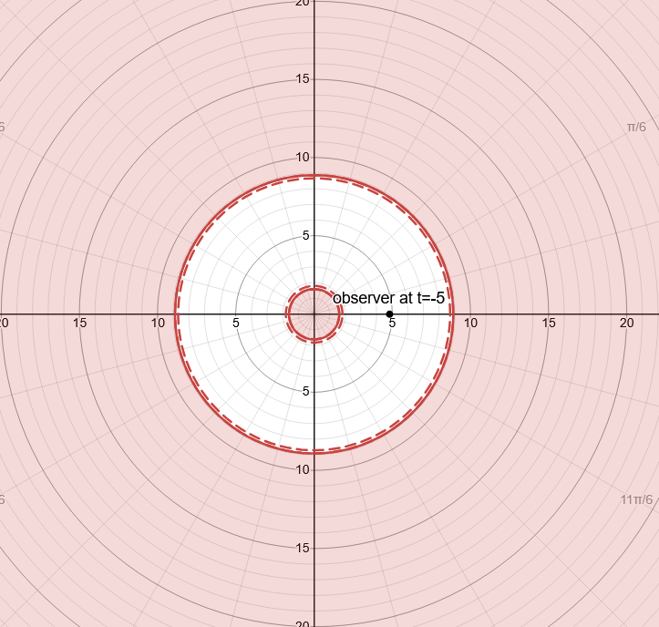

# Analysis Of Signal Boundaries

Fernando Alonso Vendrell

v0.2

# 1. Abstract

Using General Relativity, this paper discusses different regions of space-time based on wether a signal on these regions can or can not be received by an Observer. This analysis is observer dependent, from individual Obsevers it will be derived comonalities for different Observers that share some characteristics of their worldlines.

This paper follows exclusivelly standard General Relativity equations under some simple scenarios, these scenarios are built as spherically simetric and presented graphically to identify the different regions of spacetime of interest. This paper does not derive any physical consequences from the analysis of these regions.

# 2. Introduction and Definitions

Whether a signal emmited from an Event in spacetime with coordinates (t_sub_event,r_sub_event,theta_sub_event, phi_sub_event) is detected or not by an Observer according to General Relativity is something that can be calculated. This fact is independent of the coordinates system, driving different conclusions in different coordinates systems should be due to limitations on the coordinates systems used. 

Definitions:

* Observer: An Observer is a very small size, very small mass (but non zero). The Observer moves according to General Relativity. The Observer has a proper time for which an arbitrary Event in its wordline (t_sub_zero, r_sub_zero, theta_sub_zero, phi_sub_zero) is selected as proper time being zero (Zero Event). Events in the Observers wordline might have positive or negative proper time wether they happened before or after the Zero Event from the Observer perspective.

* Blip: A Blip is an onmnidirectional signal emitted at speed of light by a particle at a given Event, that signal is an idealization in the sense that it can always be detected by the Observer if it crosses the Observer wordline and also it does not interact via any other field or force with the rest of elements of the scenario. A Blip consist of the complete set (infinite) of outgoing null geodesics with origin in the Event of reference (Blip Event). For shortenes these null geodesic will be referred as Rays.

Blip frontline at any time t can be considered continuous, changes in a smooth manner with time and can be divided into small orientable sectors defining a close volume on top and a close volume at the bottom. This and the exceptions is detailed in ANNEX A.

* Blip Detection by Observer: A Blip is detected by an Observer between t1 and t2 if between t1 and t2 the Observer is not in a physical singularity and if at t1 it is spacially near to a Blip frontline triangular sector at the top and at t2 is spacially near to the same sector at the bottom. Then there must be an Event at t3 between t1 and t2 when one ray within the sector had the same spacial coordinates of the Observer. Figures to visualize this have been added in ANNEX B.

Note: There are several references to "close enough" (spacially or in time) or "close directions", which imply that, in general, care have to be taken when picking the Blip frontline sectors. For the purpose of this paper additional conditions will be used to ease confirmation that a Blip has been detected by an Observer, so detection can be determined graphically.

* Blip detection transitivity: If an Event A is origin of Blip A and it is observed by Observer B at Event B and Event B is origin of Blip B which is observed by Observer C at Event C then Blip A must have been observed by Observer C in an Event C' (which might be the same as Event C or happened at an earlier proper time from Observer C perspective), this facilitates identifying the section of detectable Events by a particular Observer as it is not necesary to check the actual Blip detection but a set of detections which might be easier to prove.

* Signal Boundary: A Signal Boundary is a spacetime region that is left once it is excluded all the Events in spacetime whose Blips are known to be detected by the Observer and all the Events in spacetime whose Blips are known to be not detected by the Observer. This definition is purposelly left rough, or dependent of the precision on the analysis, as the goal is to identify whether that Boundary exists or not and its numerical approximation. In a perfect, infinite precission calculations the signal boundary becomes a spacetime 2+1 hypersurface.

If an Event Blip is received by the observer in a finite well-defined observer proper time then the Event is said to be Ahead the Signal Boundary. If it is known that a Blip will not be received because the Observer worldline and the Blip rays wordlines do not cross then it is said to be Behind the Signal Boundary.

In Fig 1.a and Fig 1.b For a given space-like, time-like or any continuous spacetime slice, Signal Boundaries will be represented as a double red line, one solid and one dashed, to indicate from the Observer perspective the Events Behind (solid line side) and the Events ahead (dashed line side) of the Signal Boundary. This representation, mimicing the road traffic signals, also shows that, from the Observer perspective, signals emitted from the Observer could be potentially detected in Events Behid the Signal Boundary, but no signal from Events Behind will be ever detected by the Observer. Fig 1.a and Fig 1.b show the same scenario with the same Singal Boundary with different precissions as more detectable or non detectable Event regions are identified.

Signal Boundary is a way to divide the complete set of Events in spacetime for a particular Observer, this division might not exist (in this case all Events are Ahead the Signal Boundary, or more accuratelly there is no Signal Boundary), or there might be one or more spacetime regions that are behind a Signal Boundary. This definition of the Signal Boundary is independent of the global coordinates chosen.

An infinite precission Signal Boundary can be compared with Event Horizons (global property of spacetime) or Apparent Horizon (trapped null surface) as they might represent the same hypersurfaces for certain Observers but in general that is not the case as the Signal Boundary depends on the whole Observer worldline.

To do the analysis on wether an Event is Ahead or Behind this Signal Boundary one must be careful as a particular set of coordinates might not represent all the Events of interest (Events within an Observer wordline, rays worldline of an Event Blip). 

If, in one particular set of coordinates, a Blip is received by the observer in a well defined proper time, then it is known for sure the Event originating the Blip is Ahead the Signal Boundary. 

If one Blip is not received in finite proper time by the observer in one particular chosen global coordinates, it can be due to the choosen Coordinates (Coordinates singularity or Coordinates not mapping the full set of Events of interest), due to particular Observer worldline or due to Physical singularity (General Relativity singularity). In the first case (e.g. due to Coordinates singularity) it can be might miss-identified some events as being behind the Signal Boundary, this can be solved by using alternative coordinates or more Coordintates with full continuity for the Observer and Blip rays worldlines. 

In this paper all implied constants (G, c) will be set to 1. Signal Boundary analysis will focus on existence, topology and evolution with global coordinate time. 

# 3. Flat Space

First it will be analyzed 2 scenarios in flat space, the first one in which the Observer proper acceleration is zero, and a second one in which the Observer proper acceleration is constant

## 3.1. Observer proper acceleration is zero

This is the simplest scenario, in flat Minkowski empty space any Blip generated at any Event will be perceived by any Observer with proper acceleration zero, this can be depicted in the following conformal diagram. 

In Fig 2. In dark green the Observer worldline in which it has been selected an Event of it as being the zero (0) of its proper time. A Blip is generated at Event A and the signal is detected by the Observer at Event B (before the Event marked as zero).

## 3.2. Observer proper acceleration is constant forever

In this scenario there are certain Event Blips that are detected by the Observer while there are other that are not, therefore a Signal Boundary is identified.

In Fig 3. In dark green the Observer worldline in which it has been selected an Event of it as being the zero (0) also defined as the Event from which the Observer starts accelerating with constant proper acceleration getting closer and closer to the speed of light from the perspective of a non accelerating Observer. Blip originated on Event A is detected by the Observer at Event B (in this case after the Event marked as zero). Blip originated from Event C is never detected by this Observer. In red it is represented the Signal Boundary.

It is worth comparing this Signal Boundary with the Rindler Horizon \[1\]\[2\]. In this particular case the Signal Boundary is the Rindler Horizon.  

# 4. Observer on the surface of a large static spherical mass without Physical singularity

In this case although the Observer experiences a constant proper acceleration it is kept on the same position of the surface of a large non rotating spherical mass. In this scenario it could be thought that there is a Signal Boundary similar to the one in scenario 2 but if by attending to the Signal Boundary definition it can be seen that is false, there is no Signal Boundary. 

Observer wordline in this case has a constat r=R, theta and phi values and the Events to analyze will have coordinates t,r_sub_event, theta_sub_event and phi_sub_event. A slice is chosen at intervals of constant time t and due to the sperical coordinates it can be defined a 2 dimentional plane determined by the following three spacial points: The center of the Mass, the Observer and the Event spacial coordinates. 

For every t the Blip frontline can be plotted and it can be determined wether that frontline reaches to the Observer, in that case the Event will be considered to be detectable by the Observer in a finite proper time. 

The metric in this scenario can be splitted into 2 metrics, both spherically simetric with center in the large mass center. Events where r>R Schwarzschild metric can be applied depending on the large mass and pressure contributions, Events where r\<R the metric will depend on the mass and pressure distribution within the large mass which can become complex to calculate. in this case it has been set, by definition, that there is no singularity within the large mass (that scenario will be explored later).

Since there is no singularity in this scenario and the Blip frontline is a continuous 2D surface that expands from its originaing Event until the enclosed volume comprises the whole scenario (Mass, Observer and Blip Event spacial location), that means that at a certain t1 Observer is at top of certain sector of the Blip frontline, while at another t2 the Observer is at botton of that sector. The particular wordline that crosses the Observer wordline could be found, but that is outside the scope of this paper. Detection by the Observer is independent of the spacial location of the Event originating the Blip (inside the Mass or outside the mass). In this scenario there is no Signal Boundary for this Observer.

# 5. Non Rotating Blackholes

An scenario with a non rotating blackhole is the simplest one in which there is a physical singularity according to General Relativity, several scenarios and assumptions will be detailed in this section.

## 5.1. Observer worldline outside event horizon

In this case it is well known that there is an Event Horizon at the Swartzchild radius, which also defines a Signal Boundary for those Observers whose wordline always remain outside the black hole.

In Fig 4. Blips with origin inside Black Hole Event Horizon end in the singularity, depicted as an horizontal sinusoidal line. Observer wordline does not cross the Blip at any time.

## 5.2. Observer worldline ending in static black hole singularity

The next scenario Observer enters a non rotating black hole. In this case Observer wordline ends as it reaches the singularity, based on the Signal Boundary definition, there will be Blips that are detected before reaching the singularity and Blips that can not be assigned a well defined proper time once the Observer is in the Singularity.

This analyisis will be done in two approaches, in the first one (Lazy Boundaries) it will be considered that coordinates at the singularity are the same indepentent of theta and phi at a given global coordinate t, that is (t,r=0,phi_sub_1,theta_sub_1) is the same physical Event as (t,r=0,phi_sub_2,theta_sub_2) which is the usual assumption done at r=0 when there is no singularity at r=0. The Boundary Signal that exist in that case can be studied analytically, and can serve as a boundary condition to the most accurate (from the author perspective) later assumptions and scenarios. 

In the second assumption and scenario (Bean Boundary) it will be constrainged that at the singularity at a given t the Event (t,r=0,phi_sub_1, theta_sub_1) is different from the Event (t,r=0,phi_sub_2,theta_sub_2) except if phi_sub_1=phi_sub_2 and theta_sub_2=phi_sub_2. This scenario will be solved numerically to show which Events can be detected by the Observer rigth up to the last Event where Observer proper time is well defined.

### 5.2.1. Lazy Boundaries, analitical approach

In this scenario it is known that Observer reaches the singularity at a given (t_sub_fin,r=0,theta_sub_fin,phi_sub_fin) and that the Blips that it will be received at that last Event in the Observer wordline will be the ones that reach the singularity at that (t_sub_fin,r=0) any signal that reaches r=0 at a differnt t will be identified as not observed by the Observer since it can not be stated at which proper time the Observer did the observation.

To do this analysis Gullstrand–Painlevé Coordinates [3] will be used. First it will be considered the Blips whose ray reaching the singulartiy at t_sub_fin have an impact parameter b=0 [reference here to book], only radially in/out, with d_sub_phi=0 and d_sub_theta=0, following a path where theta and phi is always constant to them.

In this case the equation of motion are:

dr/dt = +1-sqrt(2M/r) for rays "pointing out"

dr/dt = -1-sqrt(2M/r) for rays "pointing in"

As a boundary condition for these equations it that at t_sub_fin then r=0, so at any prior time (e.g. -1.0 the ray must have a r value non zero), as at that coordinate is the last Event for which the Observer proper time can be calculated.

**Solution for rays "pointing in"**

Solving the Integral above such that at r=0, t=0, so C=0

t=-(4Mln|sqr(2M/r)+1|-4Mln|sqr(2M/r)|-2sqr(2Mr)+r)

at r=0 t=0

at r=M t=-(4Mlm(sqr2+1)-4Mln(sqr2)-2Msqr2+M)

at r=2M t=-(4Mln2-4M+2M) = -(4Mln2-2M) (as derived in wikipedia [3])

at r=8M t=-(4Mln(3/2)-4Mln(1/2)-8M+8M)

at r=128M t=-(4Mln(33/32)-4Mln(1/32)-32M+128M)

at r->oo t=-(-2Mln(2M/r)-2sqr(2Mr)+r)->-oo

The solution of the rays "poiting in" based on the time Observer reaches the singularity forms a hypersurface that splits the whole space time into 2 sections.

The first one is the set of Events for which any Blip generated from them will reach r=0 in t>tfin, these events have for certain t a r value greater than the r value of this hypersurface at that same t.

The second one is the reminder of Events in space time. Blips generated from these events reach r=0 in t\<tfin.

**Solution for rays "pointing out" ending in the singularity**

Integral above such that at r=0,t=0, so C=0

t=-(-4Mln|sqr(2M/r)|+4Mln|sqr(2M/r)-1|)+2sqr(2Mr)+r

Now in this case the valid range of valus for r is those r<2M as the function can not be calculated for r=2M or above as there will be zero or negative values inside the logarithms. This is an expected thing as one ray "outgoing" with b=0 outside r=2M which is the Event Horizon will go to infinity and will never reach r=0.

at r=0 t=0

at r=M t=-(-4Mln(sqr2)+4Mln(sqr2-1)+2Msqr2+M)

at r->2M t=-(4Mln|sqr(2M/r)-1|+4M+2M)->-oo

The solution of the rays "poiting out" based on the time Observer reaches the singularity forms again a hypersurface that splits the whole space time into 2 sections.

The first one is the set of Events for which any Blip generated from them will dissapear in r=0 in t\<tfin, these events have for certain t a r value smaller than the r value of this hypersurface at that same t.

The second one is the reminder of Events in space time. Blips generated from these events will have some frontline with r>0 for t>tfin.

At t=-oo this is the same as the black hole Event Horizon.

**Overall Lazy Boundaries**

With the 2 hypersurfaces defined below it can be noticed that any Blip generated at Events outside the region defined by the 2 hypersurfaces will either fully end in the singularity in a t\<tfin or will reach the singularity in a t>tfin, therefore it can not be calculated the proper time at which it is observed by Observed, therefore it is known for sure that these Events are behind a Signal Boundary.

For Blips generated at Events between the 2 hypersurfaces will cross one or the 2 hypersufaces in a time t\<tfin and since these hypersurfaces will be observed on the limit at t=t_sub_fin and taken into account Blip Detection Transitivy it can be derived that all these Events are observable by the Observer. Reminder: This is assuming that at t_sub_fin, r=0, the Observer coordinates are independent of theta and phi (later this assumption will be dropped)

These 2 hypersurfaces define a Signal Boundary, at a given time t\<tfin Events with r\<r_sub_outgoing and with r>r_sub_incoming are not observable by this Observer that reached singularity at t=tfin.

In Fig 7 an Observer following a radial raindrop trayectory sees 2 Signal Boundaries. Horizontal axis represents r coordinate in multiples of M (mass of blackhole), Vertical axis  represents t coordinate in multiples of M too. Gullstrand Painlev Coordinates.

In Fig 7.1 (same as Fig 7.) an Observer following a radial raindrop trayectory sees 2 Signal Boundaries, Observer doesn't follow a specific inertial or non inertial path. In the Conformal diagram the 2 boundaries are represented by the 2 ligth rays converging into the Observer as it reaches the Singularity.

Note that this has been depicted in previous works (likely as something obvious), in particular the author would like to bring the inspiring picture from Rogers Penrose "The Road to Reallity" in Figure 27.18 [3.1]

In Fig 8, 9 and 10 at different t (in multiples of M) the Signal Boundary is represented. Singularity is always surrounded by a Signal Boundary.

There are several considerations to analyze on these Lazy Boundaries:

* The are based on the initial, lazy, likely oversimplification that at r=0, t=t_sub_fin represents the same Event independent of theta, phi. This simplification will be dropped in the next section, for now it serves as a limit condition for the real Signal Boundary an Observer has when approaching a singularity.
* Topologically this Signal Boundary should be consider of 2 non connected hypersurfaces, and at any time the space beween them is topologically equivalent to a spherical shell.
* Signals generated very close to these Events will reach the Observer red-shifted as they will come basically with a impact factor b=0, this is not a contradiction to well stablished knowledge that signals reaching an Observer as it approaches the singularity are blueshifted since that is a condition for the general impact factor b!=0, which will actually happen for Events not so close to this Signal Boundary, which will be either detected at a t\<tfin, or at t=tfin. There is a special set of rays that reach the Observer at r=0,tfin with same theta, phi and b!=0. That will be analyzed in the next section.
* This Signal Boundary expressed in global coordinates are independent of the wordline of the Observer, the only condition is that it reaches the singularity at t=tfin, so that means that for Observers reaching the singularity at different time, even if they have some Events of their wordlines in common they will have different Signal boundaries.
* The Signal Boundaries are defined as rays to be detected in the limit when the Observer reaches r=0 at t=tfin
* The Lazy Boundaries could be infered by the Observer if a predefined set of comoving test particles with same theta, phi also falling in the singularity emit Blips at regular intervals as these will be received with increasing period by the Observer proper time, that increase of the redshift can be used to calculate the distance at which the Boundaries are and the time remaining until reaching the singularity.
* These Boundaries are telelological since they are defined on the Observer wordline ending, nevertheless that represents no difference to the previous Signal Boundaries for other scenarios which also depend on the whole wordline. It is worth an initial analysis of the Lazy Boundaries for an Observer for which its wordline is only known up to a time t and it can only be predicted the remaining wordline as inside its future lightcone from the Observer Event at time t. These Boundaries will be called Limit (Lazy) Boundaries since the Lazy Boundary determined at Observer reaching singularity can not be behind these Limit Boundaries
For this there are two scenarios for an eternal black hole. First, while the Observer is outside the Event Horizon there is only a limited set of Events known to be behind the Signal Boundary which is inside the Event Horizon. For the remaining Events nothing can be stated wether they are behind or ahead a Signal Boundary. Second, once the Observer is inside the Event Horizon then the Limit Boundary also puts certain Events outside the Event Horizon behind this Boundary.

In Fig 11 and 12 it is shown Limit Boundaries wether the Observer is outside or inside the Event Horizon

### 5.2.2. Bean Boundary, numerical approach

In comparison to the previous approach to the Lazy Boundaries where it was determined with certainty the Events whose Blips will not be detected by the Observer, Now it will identified Events whose Blips will be detected with certainty by the Oberserver before reaching the singularity. This approach also discards the common consideration while using polar coordinates to consider that at certain t if r=0 Events at that place have the same coordinate independent of theta, phi. There is no reason to do so if at r=0 there is a singularity where nothing should be stated about it.

In order to do so a similar approach as used before will be used, trace back rays but in this case all rays that at t=t_sub_fin have r very close to 0, and same theta and same phi. Since there is spherical simmetry and knowing that light rays lie in a plane, analysis can be done for a particular fixed phi so dphi=0, once analyzed the whole solution will be a revolution around the axis at that phi. To ease calculations it will be considered theta of the Observer at t=0 also as theta=0.

For all the rays that end at r almost 0, t=t_sub_fin, theta=0 it will be identified their r, theta for any t\<tfin.

Unfornunatelly there is no method known to the author to derive it via solving differential equation , only numerical analysis of the rays for which it will be used a modified version of the program gorbits [4][5] to do the following:

* It already solves the differential equations for light rays
* Since the equations are time simetric they will be run with negative dt
* Starting condition will be r very close to zero, t=0, and Theta=0 with a varying ranges of impact factor b from zero to infinity both for incoming and outgoing rays.

Solving the equations for events received by Observer at r=0.001 and plotting it at different t\<tfin 

In Figs 13_raw and 13 it is plotted the Bean Boundary at a time t when the Observer is still far from the Event Horizon

In Figs 14_raw and 14 it is plotted the Bean Boundary at a time t when the Observer gets closer to the Event Horizon, the shape starts to differ from the 2 circles of the Lazy Boundaries

In Figs 15_raw and 15 it is plotted the Bean Boundary at a time t when the Boundaries become one single Signal Boundary.

In Figs 16_raw and 16 it is plotted the Bean Boundary once the Observer is inside the Event Horizon, it takes the shape of a Bean in the chosen coordinates.

In Figs 17_raw and 17 as the Observer approaches the singularity the Bean Boundary and it becomes more convex.

There are several considerations to analyze on the Bean Boundaries:

* Main assumption is that the Observer can only observe Blips at same t, r, theta, phi as Events in Observer wordline.

* Topologically this Signal Boundary is a single connected hypersurface, although far from falling in the Event Horizon at a given time the space in it is a sperical shell after a certain t the space in it becomes a ball, shaped at some time like a Bean thus giving the name to this Boundary.

* At any time there are 2 points of the Bean Boundary that are the same for the corresponding Lazy Boundary.

* Signals generated very close to these Events will reach the Observer blue-shifted as they will come basically with a impact factor b!=0 (with the exception of 2 points within this Boundary that match the Lazy Boundaries and that was discussed in previous section.

* As in the case of Lazy Boundaries, This Signal Boundary expressed in global coordinates are independent of the wordline of the Observer, the only condition is that it reaches the singularity at t=t_sub_fin, so that means that for Observers reaching the singularity at different time, even if they have some Events of their wordlines in common they will have different Signal boundaries.

* The Signal Boundaries are defined as rays to be detected in the limit when the Observer reaches r=0 at t=t_sub_fin

* The Bean Boundary, same as Lazy Boundaries, could be infered by the Observer if a predefined set of comoving test particles with same theta, phi also falling in the singularity emit Blips at regular intervals as these will be received with increasing period by the Observer proper time, that increase of the redshift can be used to calculate the distance at which the Boundaries are and the time remaining until reaching the singularity. The Bean Boundary could also use comoving test particles with different theta and phi, the Observer will detect initial redshit on these too but they will be followed by a blueshift as the Observer approaches the singularity.

# 6. Conclusions and further work

It has been shown that for an Observer falling behind an Event Horizon of a non rotating black hole a Signal Boundary is formed around it, surrounding it totally. 

It has been shown that as the Observer approaches the Singularity the Signal Boundary gets closer to it. Nothing has been stated about the shape from the Observer perspective.

The modified version of grorbits used in this paper, the images and the desmos plots will be made publicly available for review.

Following work should be considered:

* For Bean Boundary do further simulation with smaller initial r (analysis was done with r=0.001) and smaller dt (analysis was done with dt=0.001)

* For Observers falling in non rotating black hole. Identify from Observer perspective where the Signal Boundary is at a certain moment, this has the dificulty to define in a consistent way simultanous Events in curved spacetime for Observers moving in it. 

* Further probabilistic analisys on the Limit (Lazy) Boundaries, based on the Observer position and momentum (with its corresponding uncertainties) at a certain time t, it should reflect on probability distribution of the Lazy Boundaries within the Limit ones.

* Identify if there are any Signal Boundaries for Observers falling a rotating black hole and if there are what are the assumptions taken. Similar assumption could be made for Observers falling in the ring singularity as no proper time can be calculated for it or for which Signals can not reach them in finite Observer proper time.

* Derivation of observable efects in relation to Quatum Fields, which might be measurable by the Observer before passing the Event Horizon and which might help to identify if the Singal Boundaries described in this paper align with experiments and which (Lazy Boundaries, Bean Boundary or a probabilistic distribution within the Limit Boundaries) assumption fits better the data. Related to this point the author has written a separate paper on how this could be done, the paper is titled "Speculative Consequences Of Signal Boundaries".

# 7. Adknowledgements and Disclaimer

The author would like to specially thank Edwin F. Taylor, John Archibald Wheeler, and Edmund Bertschinger as most of this paper is written based on these authors derivations for static Black Holes [6] and this investigation was triggered by Andrew Hamilton [7].

This version (v0.1) has not been reviewed at all, the author recognizes that until it is reviewed there can be errors that make conclusions not valid, or that this analysis has already been done by other authors, in this case I recognize whoever did this before me by Aug 2025.

# 8. References 

* [1] https://en.wikipedia.org/wiki/Hyperbolic_motion_(relativity)
* [2] https://en.wikipedia.org/wiki/Rindler_coordinates
* [3] https://en.wikipedia.org/wiki/Gullstrand%E2%80%93Painlev%C3%A9_coordinates
* [3.1] https://books.google.com.ni/books/about/The_Road_to_Reality.html?id=coahAAAACAAJ
* [4] https://stuleja.org/grorbits/
* [5] https://github.com/f-alonso-vendrell/grorbits
* [6] https://www.eftaylor.com/exploringblackholes/
* [7] https://jila.colorado.edu/~ajsh/insidebh/schw.html

Additionally the following articles have inspired this paper.

* Roger Penrose - The Road to Reallity
* Abhay Ashtekar, Badri Krishnan - Dynamical Horizons and their properties - https://arxiv.org/abs/gr-qc/0308033 
* Jonathan Thornburg - Event and Apparent Horizon Finders for 3+1 Numerical Relativity - https://arxiv.org/abs/gr-qc/0512169
* W. Rindler - Visual Horizons in World Models https://academic.oup.com/mnras/article/116/6/662/2603910?login=false
* K Raviteja - gravitational collapse, Apparent vs Event Horizons https://youtu.be/ZeprxnZkFC8?t=1460
* Emel Altas, Bayram Tekin - Basics of Aparent Horizons in Black Hole Physics - https://arxiv.org/abs/2108.05119
* Geraint F. Lewis, Juliana Kwan - No Way Back: Maximizing survival time blow the Schwarzschild event horizon - https://arxiv.org/abs/0705.1029
* William H. Kinney - Horizon crossing and inflation with large N - https://arxiv.org/abs/gr-qc/0503017
* Rosa Doran, Francisco S. N. Lobo, Paulo Crawford - Interior of a Schwarzschild black hole revisited - https://arxiv.org/abs/gr-qc/0609042
* Wikipedia - Shell Theorem https://en.wikipedia.org/wiki/Shell_theorem
* Wikipedia - Kruskal Szekeres coordinates https://en.wikipedia.org/wiki/Kruskal%E2%80%93Szekeres_coordinates 
* Wikipedia - Spherical collapse model https://en.wikipedia.org/wiki/Spherical_collapse_model
* Shenshun Yao - Spherically Symmetric Collapse of Stars https://www.math.mcgill.ca/gantumur/math599w19/spherically_symmetric_collapse_of_stars.pdf#:~:text=Oppenheimer%E2%80%93Snyder%20spherical%20dust%20collapse%20Oppenheimer%20and%20Snyder(1939),to%20treat%20more%20complicated%20scenarios%20numerically%20%5B2%5D.
* Symbolab - Integral Calculator online: https://es.symbolab.com/solver/integral-calculator/%5Cint%5Cleft(1-sqrt%5Cleft(2M%2Fr%5Cright)%5Cright)%5E%7B-1%7D%20dr?or=input
* Desmos - Graphical Calculator online: https://www.desmos.com/calculator?lang=es

# ANNEX A - Blip Continuity

Blip frontline spacial continuity: At a given timeslice (global coordinate t fixed) it is defined the Blip frontline (built by the Events that are part of the rays at that timelice) as a 2D surface which is continuous except in those points where there are physical singularities. If there is a physical singularity it can not be assured if the Blip frontline is continuous or not at that point. 

The continuous part of this 2D surface can be divided into small triangular sectors, each identified its 3 vertices by the 3 null geodesics that pass thru them and where generated at the Blip Event with intial similar direction. The sector triangle defines a flat surface whose points are close enough to the Events in the rays with initial direction constrained within the thre selected rays at that timeslice.

In Fig 18 A Event generates a Blip in flat space at t_sub_0, Blip frontline is represented at a later times t1 and t2. 3 rays are chosen to define one triangular sector

In Fig 19. The Blip frontline may intersect with itself, definition of the sectors includes the initial similar direction criteria at the Blip Event to discard rays with events at the timeslice are spacially close but originated with a different direction, as triangles formed this way contains points that are far from the frontline. The 3 paralell rays form a triangular sector the fourth ray can not be used to define a sector with the previous 3 rays.  

The Blip triangular sectors defined this way are orientable (e.g. An arbitrary order of the vertices can be chosen (each associated to a ray) and define which side is top and which is bottom).

Additionally for two timeslices close enough (t1 and t2), if none of the rays within a triangular sector (defined by ray 1, ray 2, and ray 3) end in a singularity between t1 and t2 both included, then wthe definition of orientation can be kept between t1 and t2. In this case, the triangular sector changes with time in a continous manner.

# ANNEX B - Blip detection by Observer

In Figure 20 it is graphically described how the Blip detection is defined, based on the orientability of small sectors of the Blip frontline and that at a t1 the Observer is one side and at t2 is in the other side.

# ANNEX C

Fun Note: An extreme example of Observer on planet without singularity which can be numerically calculated is the hollow planet in which a very thin spherical surface has a large mass and the pressure contribution is included to calculate r_sub_s for Schwarzschild metric outside. In this case our Global Coordinates with Schwarzschild outside the mass can be patched with flat Minkowsky space inside with the corresponding scaling to match the 2 metrics in at the surface of the mass. This would be like Enders game training scenario, outside it an Observer could experience the planet surface gravity, once the Observer crosses the surface it will experience zero gravity.

