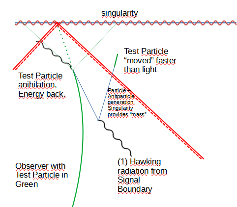

# Speculative Consequences Of Signal Boundaries for Swartzchild Black Holes

Fernando Alonso Vendrell

v 0.1

# 1. Abstract

In a previous paper from this auther it was shown that for any Observer crossing the Event Horizon, it will surrounded by a shrinking signal boundary not being able to receive information from Events behind that Boundary. This, should have measurable effects, even before crossing the Event Horizon and are related to Hawking radiation.

# 2. Introduction 

IF the previous paper on "Analysis of Signal Boundaries" claims for Observers approaching a Singularity and

IF the size and proximity of the Signal Boundaries yields to an intrinsic temperature measured by the Oberver and

IF that temperature increases as the Signal Boundaries approaches the Observer 

THEN some measurable effects should take which could help explain the interior of the Swartchild Black Hold being fully compatible with General Relativity and Quantum Mechanics.

The author will enumerate these in the hope that can be used, either by confirming or by falsifying, to understand better General Relativity and Quantum Mechanics.

# 3. Speculative Consequences

Following a list of consequences if the 3 IFs are considered true.

## 3.1. A firewall of another kind

One of the proposals related to Black Holes is that a Firewall appears as the Observer crosses the Event Horizon [1]. The Consequence of Singal Boundaries is that as the Observer approaches the Black Hole and as it crosses the Event Horizon and approaches the Singularity the Signal Boundary produces an increase in Temperature of the Observer itself perceived by it as Hawking radiation [2], thus as it approaches the Event Horizon and the Singularity it will be itself a Firewall.

This temperature should be measurable even before crossing the Event Horizon, which can be transmitted to a far away observer and help define which of the Signal Boundaries presented in previous paper align better

## 3.2. Information is lost or it is not

Related to Quatum Information lost and the firewall approach was to break any entanglement, unfortunatelly, the author thinks that Signal Boundaries do not provide any help in determining wether information is lost or not, although it seems a way to break entanglement, it could also be interpreted as a mechanism to perform measurements of the matter inside the Event Horizon. 

The discussion is kind of tautological:

* If the Hawking radiation contains information of the infalled matter then that information is also imprinted into the Observer so the Hawking radiation contains information of a system including matter that felt inside later.

* If the Hawking radiation does not contain information of the infalled matter then a noisy set of measurements happen to the Observer so losing also the information of the matter that felt inside later.

## 3.3. Faster than light without being faster than light

Based on General Relativity it is unavoidable for a particle to end in the Singularity once it crosses the Event Horizon of a Swartzchild Black Hole as the particle would have to move faster than light for that to happen. If we have a Signal Boundary that surrounds any particle falling towards the singularity migth provide a mean for the particles not to reach the singularity.

The way we can do this is by treating the Signal Boundary as a Source and Sink of momentary additional energy. E.g. for an infalling particle, if a particle-antiparticle is created by the proximity of the Signal Boundary, the antiparticle then anihilates the infalling particle producing a photon that is then returned to the Signal Boundary, kind of returning back to the environment the energy needed. 

After this process the particle that is left is the same kind of the one that was infalling, respects conservation laws, yet it is now outside the future light cone of the original particle, thus as if it had moved "faster than light", for now on we can call it Quatum Leap. Should this mechanism be part of the interactions within a Black Hole then it leans towards the lost of information as that would then respect moving a particle faster than light as long as no information is carried faster than light.

An additional note of this mechanism is that it can be seen as the particle Quatum Leap (in global coordinates) happens forward/backwards in time and closer/farther from Singularity. Having the particle Leap as much as needed gives some insight into two phenomenas:

* A particle might Leap into the future and far from the Singularity enough to be outside of the Event Horizon, becaming part of the Hawking radiation.

* A particle might Leap into the past being able to interact with the particles infalling at that time (e.g. for a collapsing thin shell where at r=0 there is no Singularity until the whole shell reaches r=0, but before it happens interactions due to Signal Boundaries start to happen) justifying that the whole set of particles interact with the whole set of particles at any time.

Similar Leap could happen for zero mass particles, as they might themselves transform into a particle-antiparticle and each of them be Leaping around as outlined above.

# Conclusions and further work

There are a lot of IFs in this paper so the Author considers this highly speculative, although it presents a mechanism for the infalling particles to avoid reaching the singularity, there is no real calculation nor model for it.

The mechanism itself does not give a clear direction on wether loosing or not information, although it aligns with option 1 "Hawking’s scenario: there are both horizons and singularities" in [3] favoring lost of information, we could consider that if the Leaps happen because of mutual interactions of (ALL) the particles within the Event Horizon from the past or from the future, so for all practicall purposes it is maximally scrambled.

# Adknowledgements and Disclaimer

# References 

* [1] https://en.wikipedia.org/wiki/Firewall_(physics)
* [2] S. W. HAWKING  - Black Hole Explosions - https://www.nature.com/articles/248030a0.epdf
* [3] Sabine Hossenfelder and Lee Smolin - Conservative solutions to the black hole information problem - https://arxiv.org/pdf/0901.3156

* Miguel Socolovsky - Hidden Quantum Effect in General Relativity https://www.scirp.org/journal/paperinformation?paperid=127101
* Geraint F. Lewis, Juliana Kwan - No Way Back: Maximizing survival time blow the Schwarzschild event horizon - https://arxiv.org/abs/0705.1029
* Abhay Ashtekar, Badri Krishnan - Dynamical Horizons and their properties - https://arxiv.org/abs/gr-qc/0308033 
* William H. Kinney - Horizon crossing and inflation with large N - https://arxiv.org/abs/gr-qc/0503017
* Rosa Doran, Francisco S. N. Lobo, Paulo Crawford - Interior of a Schwarzschild black hole revisited - https://arxiv.org/abs/gr-qc/0609042
* A. Ashtekar and Anne Magnon -Quantum Fields in Curved Space-Times - https://royalsocietypublishing.org/doi/10.1098/rspa.1975.0181
* Kip S. Thorne - Closed timelike curves - https://www.its.caltech.edu/~kip/index.html/PubScans/II-121.pdf
* Jonathan Thornburg - Event and Apparent Horizon Finders for 3+1 Numerical Relativity - https://arxiv.org/abs/gr-qc/0512169
* Emel Altas, Bayram Tekin - Basics of Aparent Horizons in Black Hole Physics - https://arxiv.org/abs/2108.05119
* https://academic.oup.com/mnras/article/116/6/662/2603910?login=false
* https://en.wikipedia.org/wiki/Shell_theorem
* https://en.wikipedia.org/wiki/Hyperbolic_motion_(relativity)
* https://en.wikipedia.org/wiki/Rindler_coordinates
* https://en.wikipedia.org/wiki/Kruskal%E2%80%93Szekeres_coordinates 
* https://www.math.mcgill.ca/gantumur/math599w19/spherically_symmetric_collapse_of_stars.pdf#:~:text=Oppenheimer%E2%80%93Snyder%20spherical%20dust%20collapse%20Oppenheimer%20and%20Snyder(1939),to%20treat%20more%20complicated%20scenarios%20numerically%20%5B2%5D.
* https://en.wikipedia.org/wiki/Spherical_collapse_model
* https://youtu.be/ZeprxnZkFC8?t=1460
